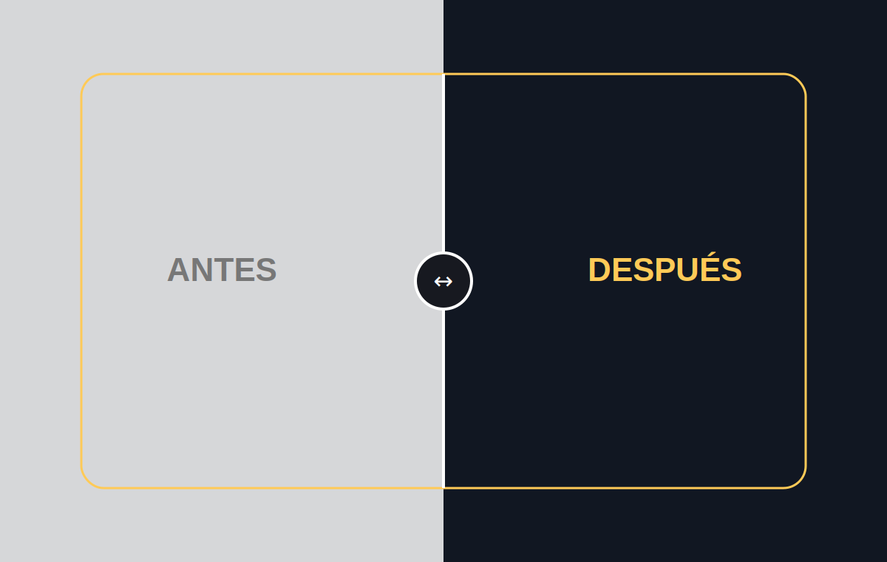

# Before After Image Slider

Comparador de alto contraste que transforma un wireframe plano en una experiencia futurista con 3D, cristal, luz y movimiento.

## Características

- `role="slider"` con valores ARIA sincronizados.
- Flechas, Shift + flechas, Home y End.
- Botones para 0%, 50% y 100%.
- Reproducción cinematográfica automática bajo demanda.
- Escena final SVG animada con esfera 3D, órbitas, partículas y tarjetas flotantes.
- Lectura visual coherente: el diseño final se revela a la izquierda y el borrador permanece a la derecha.
- Comparador completo visible en una sola toma de escritorio.

## Demo en vivo

[before-after-image-slider.netlify.app](https://before-after-image-slider.netlify.app)

## Instalación

Clona el repositorio, entra en `before-after-image-slider` y abre `index.html`.

## Estructura del proyecto

Comparador en `index.html`, recorte y pulido visual en `style.css`, composición de captura en `capture.css`, reproducción multimodal en `script.js` y escenas SVG en `assets/`.

## Cómo personalizarlo

Reemplaza `before.svg` y `after.svg` por escenas del mismo encuadre; conserva sus dimensiones explícitas y adapta los textos alternativos.

## Accesibilidad

El control anuncia porcentaje y sentido, funciona por teclado y ofrece botones alternativos con etiquetas claras.

## Rendimiento

El recorte y la reproducción se agrupan por frame; las escenas son SVG locales y toda animación respeta `prefers-reduced-motion`.

## Licencia y créditos

[MIT](LICENSE). Creado por [Nacho Torres](https://github.com/NachoTorresRD) para [NTDESWEB](https://www.ntdesweb.com) con [NT-SKILL SUPREME](https://github.com/NachoTorresRD/nt-skill-supreme).

[Ver en GitHub](https://github.com/NachoTorresRD/before-after-image-slider) · [Trabajar con NTDESWEB](https://www.ntdesweb.com)
